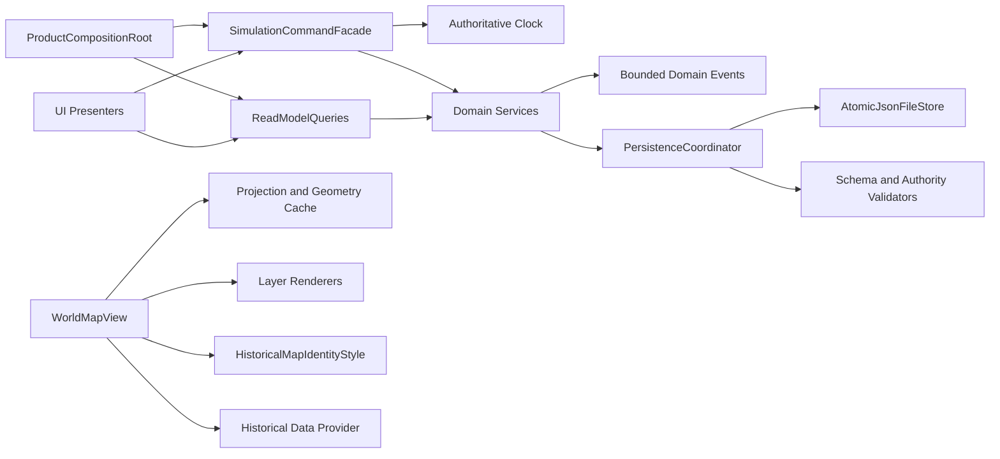

# 变量冗余与架构重新整合审计

审计日期：2026-07-30  
审计基线：`b24135a`  
指定运行时：Godot `4.6.3.stable.official.7d41c59c4`，Compatibility  
范围：`scripts/**/*.gd`、实际场景入口、保存边界、地图 UI 继承链及相关测试

## 1. 结论

项目不存在“海量声明后未使用的死变量”。最终静态扫描覆盖 185 个生产
GDScript，识别 9,462 个变量/常量声明，其中 7,884 个是局部变量：

- 非下划线且声明后完全未引用的局部变量：`0`。
- 只被读取一次的局部变量：`1,666`，占局部变量 `21.1%`。
- 特殊名称或邻接特殊注释候选：`21`。
- 重复 `class_name`：`0`。
- 字节级重复生产脚本：`0`。
- 零引用生产脚本：从 `1` 降为 `0`。

“只被读取一次”不等于冗余。抽样和逐热点检查表明，它们主要承担强类型
收窄、字典字段命名、事务快照、结果对象和绘图几何中间值。批量内联会降低
权威状态边界的可读性，并增加重复索引或类型转换。真正需要处理的是：

1. 同一原子保存算法在多个服务中复制；
2. 按版本和修补轮次叠加的深继承；
3. 超大服务和超长函数形成的职责聚合；
4. 少数语义模糊的 `temporary` / `migration` 局部名；
5. 一个历史地图质量脚本存在但未接入运行链。

本次已完成三个实质性架构整合：统一原子 JSON 文件边界，把一次性的地图
发布质量层改为可复用身份样式组件，以及让地图作用域、玩家位置和城市锚点
共同使用几何缓存。没有为了降低数字而删除有领域语义的变量、DTO、迁移状态
或权威快照。

## 2. 可复现审计方法

`tools/audit_runtime_code.py` 已从一次性清理记录改造成可复用审计器，当前检查：

- 类名冲突、字节级重复脚本和零引用候选；
- 文件行数、函数行数和薄子类；
- 脚本继承链及最大深度；
- 函数作用域内变量的引用次数；
- 特殊名称及特殊邻接注释；
- 一次性变量热点和逐文件占比。

重跑命令：

```powershell
python -B tools\audit_runtime_code.py `
  --root . `
  --json-output artifacts\runtime-code-audit.json `
  --markdown-output artifacts\runtime-code-audit.md `
  --fail-on-hard-findings
```

审计器会去除注释和字符串后计数，并按函数范围判断局部引用。它是保守的
审查信号，不会自动删除变量。Godot 的动态 `call`、`get`、场景资源引用和外部
成员访问无法仅凭词法分析完全证明，因此零引用和薄子类仍要求人工确认。

## 3. 前后指标

| 指标 | 审计前 | 整合后 | 解释 |
|---|---:|---:|---|
| 生产脚本 | 184 | 185 | 新增两个通用组件，删除一个一次性发布层 |
| 变量/常量声明 | 9,500 | 9,462 | 净减少 38 个声明 |
| 非下划线未使用局部变量 | 0 | 0 | 没有死变量堆积 |
| 特殊名称/注释候选 | 26 | 21 | 临时路径集中化并改善模糊命名 |
| 重复类名 | 0 | 0 | 无硬冲突 |
| 完全重复脚本组 | 0 | 0 | 无字节级复制 |
| 零引用候选 | 1 | 0 | 历史地图质量行为已重新整合 |
| 650 行以上文件 | 22 | 22 | 仍是主要债务 |
| 120 行以上函数 | 22 | 21 | 一次性质量层移除后减少 1 |
| 最大脚本继承深度 | 16 | 16 | 不再为接入质量行为增加到 17 |
| 薄子类候选 | 26 | 27 | 新增的是明确的 V2.2 备份策略适配器 |

局部变量的最终模块分布：

| 模块 | 文件 | 局部变量 | 单次读取 | 比例 |
|---|---:|---:|---:|---:|
| `v2_3` | 44 | 2,054 | 334 | 16.3% |
| `alpha` | 28 | 2,003 | 472 | 23.6% |
| `ui_spikes` | 20 | 1,207 | 389 | 32.2% |
| `v2_2` | 20 | 825 | 107 | 13.0% |
| `world_map` | 11 | 697 | 176 | 25.3% |
| 其他生产模块 | 62 | 1,098 | 188 | 17.1% |

`ui_spikes` 和世界地图的单次读取比例较高，主要来自绘图坐标、颜色、命中
测试和类型化数据提取。Alpha 的绝对数量高，但它同时是隔离夹具/审计入口，
不能在未决定产品去留前与正式 V2.3 模拟合并。

## 4. 一次性变量判定

### 4.1 应保留

以下类型的一次性局部变量具有通用维护价值：

- `Dictionary` / `Array` 的强类型收窄，例如先取 `record` 再校验字段；
- 权威结算前快照，例如旧现金、地图、日程和旅行状态；
- 事务候选状态，例如载入时先建立候选社会，再一次性替换正式会话；
- 公式分量，例如准备度、权限、资金和状态修正；
- UI 几何和颜色命名，例如 `badge`、`rect`、`world_anchor`；
- 结果对象，例如迁移结果、领域验证结果和失败原因。

这些变量即使只读一次，也隔离了副作用、明确了单位/类型，或让规则可以在
调试和测试中被定位。将它们机械内联不属于维护性改进。

### 4.2 已改善

本次对语义模糊而非领域特殊的名称进行了替换：

| 原名称 | 新名称 | 理由 |
|---|---|---|
| `temporary` | `swap_value` | 明确是 Fisher-Yates 交换槽，不是临时业务状态 |
| `temporary_society` | `candidate_society` | 明确是提交前候选聚合根 |
| `migration`（AI 调用） | `migration_result` | 区分命令结果和迁移领域记录 |
| `migration`（劳动服务） | `migration_record` | 明确持久化记录语义 |
| `migration`（存档链） | `migration_metadata` | 明确是版本链元数据 |
| `migration`（场景结果） | `migration_record` | 明确读取的是结果记录 |
| `migration`（UI 成员） | `save_migration` | 明确成员是存档迁移服务 |
| `legacy_before` | `legacy_cash_before` | 明确兼容快照的领域与时间点 |

### 4.3 特殊候选的完整处置

最终 21 个候选均已人工分类：

| 位置/名称 | 数量 | 处置 |
|---|---:|---|
| Alpha `migration_result` / `migration_record` / `migration_metadata` / `save_migration` | 5 | 保留；现已区分结果、记录、元数据和服务 |
| Alpha `_last_legacy_cash` / `legacy_cash_before` | 2 | 保留；是旧生活账本与 Alpha 权威账本的显式兼容桥 |
| `OrganizationService.LEGACY_BASE_ORGANIZATION_IDS` / `legacy_content_migration` | 2 | 保留；只在旧内容迁移边界生效 |
| `AtomicJsonFileStore.TEMPORARY_SUFFIX` / `temporary_path` | 2 | 保留；已集中到唯一通用文件事务实现 |
| 菜单 `legacy_title` / `legacy_phase` | 2 | 保留；对应仍存在的旧场景节点，且有兼容探针 |
| V2.3 `save_migration` | 1 | 保留；是明确的迁移服务依赖 |
| `SCHEMA_VERSION`、`LIFE_LOOP_SCENE`、`manual_location_holds`、`controlled_simulation`、`social_sandbox`、`FILES` | 7 | 名称本身不特殊；由文件头相邻注释触发，属于保守误报 |

## 5. 已实施的架构重新整合

### 5.1 原子保存统一

新增 `scripts/save/atomic_json_file_store.gd`，唯一负责：

1. 建立目录；
2. 清理同路径旧临时文件；
3. 写入并刷新 JSON 临时文件；
4. 调用领域注入的校验器；
5. 轮换旧主文件为备份；
6. 原子替换；
7. 替换失败时恢复旧主文件；
8. 根据调用策略保留或清理备份。

V2.2、V2.3、Alpha 和基础存档现在只提供各自的快照校验器及备份策略。
`V2ReviewSaveService` 从约 110 行重复实现缩为一个 9 行策略适配器。保存格式、
完整性算法、权威状态校验和 `.bak` 语义没有被合并或削弱。

这一修改把多个 `temporary_path` / `backup_path` 特殊实现变成所有存档变量
可以联动复用的文件事务边界。

### 5.2 历史地图质量层改为组合

原 `holographic_workspace_release_quality.gd` 是零引用的一次性发布层。直接把
它插回继承链会把历史地图从 16 层加深到 17 层，因此本次没有保留该结构。

新增 `scripts/world_map/historical_map_identity_style.gd`，集中管理：

- 实体身份模式的编码和解码；
- 稳定实体序号；
- 身份码板的坐标、半径、颜色和位编码；
- 可注入的对比色计算。

历史证据层通过组合调用该样式组件，并直接承担其数据来源/现代参考告警。
原一次性发布脚本已删除。地图发布探针和一级行政区探针均通过，且运行栈
确认身份样式参与实际绘制。

### 5.3 审计器通用化

移除了审计工具里“本次删除某工作流”的硬编码历史记录。审计结果不再描述
某一次清理，而是每次根据仓库当前状态生成，适合继续接入 CI。

### 5.4 地图坐标缓存统一

统一验证发现 V2.3 动态真实数据覆盖层在刷新只读视图时仍重复执行 12 次地图
投影，违反“数据未变化时复用几何”的现有性能守卫。根因不是测试，而是
`world_map_canvas.gd` 虽已缓存本地位置点，作用域、玩家位置和城市父级锚点
仍各自绕过缓存重新投影。

本次新增统一的 `_cached_world_point(location)` 查询边界，并让基础 Canvas 与
Player 扩展共同使用。地图集成回归的重复投影次数恢复为 `0`。这使坐标变量
由多个特例路径联动到同一个几何缓存，而没有改变投影公式或地图权威数据。

## 6. 仍存在的主要架构债务

### 6.1 P0：年度模拟性能不达标

统一验证运行到 `tests/v2_3/v2_3_performance_guard_test.gd` 时，年度模拟在第
150 天已耗时约 `143,068 ms`，随后被验证进程的 180 秒外层超时终止。该测试
自身要求 365 天不超过 `90,000 ms`，因此即使放宽外层超时，当前实现也已不可
能通过产品预算。

本次没有修改模拟公式，也没有提高预算或降低人群覆盖来让测试变绿。下一轮
重塑必须先对 `V23ProductSimulationV2`、社会沙盒逐小时处理和全量人物扫描
做采样剖析，确认增长复杂度后再拆分服务。修改模拟公式后，现有历史性能记录
必须按项目约束作废并重建。

### 6.2 深继承

当前最深链仍有 16 层：

```text
HistoricalAdminRuntime
 -> HistoricalEvidenceUI
 -> HistoricalEvidence
 -> Release
 -> CrispRuntime
 -> HudPolish
 -> FinalPolish
 -> CrispFlagsFixed
 -> Admin1
 -> History
 -> FlagTuning
 -> Flags
 -> Final
 -> Polish
 -> Visual
 -> Runtime
```

正式 V2.3 也存在版本继承：

- `V23PlayerInterface`：9 层；
- `V23ProductSimulationV2`：8 层；
- `V23PlayerUiBinding`：7 层。

风险不是虚函数本身，而是职责和初始化顺序分散在多个发布轮次脚本里。
`super._ready()`、`super._draw_*()` 或恢复顺序中任一遗漏都会静默跳过整层行为。

### 6.3 超大文件

22 个文件超过 650 行：

| 行数 | 文件 |
|---:|---|
| 2,640 | `scripts/world_map/internal/world_map_canvas_impl.gd` |
| 2,455 | `scripts/v2_3/v2_3_social_sandbox_service.gd` |
| 1,828 | `scripts/world_map/internal/world_map_interface_impl.gd` |
| 1,548 | `scripts/ui_spikes/holographic_workspace/holographic_workspace_runtime.gd` |
| 1,457 | `scripts/alpha/alpha_politics_service.gd` |
| 1,441 | `scripts/simulation/society_simulation_service.gd` |
| 1,432 | `scripts/alpha/alpha_economy_integration_service.gd` |
| 1,424 | `scripts/alpha/alpha_simulation_service.gd` |
| 1,133 | `scripts/alpha/alpha_scenario_runner.gd` |
| 1,097 | `scripts/alpha/alpha_enterprise_service.gd` |
| 1,093 | `scripts/v2_3/v2_3_social_sandbox_service_v2.gd` |
| 1,075 | `scripts/v2_2/v2_life_loop_simulation.gd` |
| 1,032 | `scripts/alpha/alpha_economy_service.gd` |
| 952 | `scripts/alpha/alpha_commodity_market_service.gd` |
| 941 | `scripts/v2_3/v2_3_life_loop_simulation.gd` |
| 867 | `scripts/alpha/alpha_ui_binding.gd` |
| 842 | `scripts/v2_3/v2_3_controlled_simulation.gd` |
| 817 | `scripts/v2_2/v2_schedule_service.gd` |
| 776 | `scripts/ui_spikes/holographic_workspace/holographic_workspace_history.gd` |
| 750 | `scripts/action/player_action_context_service.gd` |
| 739 | `scripts/alpha/alpha_character_service.gd` |
| 695 | `scripts/save/game_save_service.gd` |

应优先拆正式产品路径的前三个聚合点，不应先为降低统计数字重写隔离 Alpha
夹具。

### 6.4 超长函数

21 个函数达到 120 行；最高风险项为：

| 行数 | 函数 |
|---:|---|
| 282 | `V23FormalScheduleInterface._draw_schedule_panel` |
| 262 | `HolographicWorkspaceInteractionProbe._run_probe` |
| 212 | `AlphaSimulationService._known_ai_snapshot` |
| 200 | `V2LifeLoopInterface._draw_schedule_panel` |
| 182 | `GameSaveService.restore_snapshot` |
| 176 | `ActionRulesConfig.load_from_file` |
| 173 | `V23SocialSandboxService._derive_situations` |
| 173 | `V23SocialSandboxService._apply_effect` |
| 172 | `WorldMapInterfaceImpl._activate` |
| 169 | `V23FormalInterface._draw_formal_finance_panel` |

其余 11 个在生成的 `artifacts/runtime-code-audit-final.md` 中逐项列出。报告文件
是本地生成物，不进入版本库。

### 6.5 薄子类

27 个薄子类中，多数是有价值的 DTO、结果类型、场景适配器或策略覆写，不能
只按行数删除。需要重点限制的是名称带 `final`、`polish`、`v2`、`v3` 且仅为
继续覆盖父方法的发布轮次层；`RefCounted` 结果对象和稳定 ID 模型不属于问题。

### 6.6 既有验证与导出警告

若干 V2.3 独立测试结束时报告 `ObjectDB` / Resource 泄漏警告，最多观察到
41 个资源仍在使用。当前没有证据表明它改变模拟结果，但它会污染长期回归和
性能取样，应作为测试装配/释放生命周期债务处理。

历史地图探针仍报告若干历史旗帜通过 `Image.load_from_file` 直接载入，在导出
包中可能不可用。该警告在本次重构前已存在，本次没有声称 Windows Release
导出通过。应改为 Godot 导入资源或显式打包可读文件后再做导出验证。

## 7. 目标架构



目标不是一次性重写，而是逐个切断版本继承：

1. 组合根只装配服务，不实现领域公式；
2. 命令门面只处理命令、权限和事务边界；
3. 查询模型只返回只读视图；
4. UI 绘制拆成可组合面板/图层，不通过 `super` 链叠加；
5. 保存协调器统一文件事务，领域验证器保持独立；
6. 旧版本类在存档迁移窗口结束前保留为适配器，不继续承接新功能。

## 8. 后续重塑顺序

### P0：年度模拟剖析与复杂度收敛

- 对 30、90、150、365 天分别采样，区分模拟计算、社会事件、索引扫描和测试
  装配耗时；
- 查找逐小时全人物扫描、重复派生视图和无界事件/历史列表；
- 优先引入增量索引与有界批处理，不改变已过区间的权威结算语义；
- 用同一固定种子对比快照、事件顺序、30 日和年度结果。

验收：365 天在现有 `90,000 ms` 产品预算内完成，且确定性、存档、NPC 时间
边界和 Codex 审计回归全部保持一致。

### P1：正式产品组合根

- 为 `V23ProductSimulationV2` 建立明确的组合根；
- 把生存自主、社会沙盒、旅行、请假作为注入服务；
- 冻结现有 8 层继承链，只接受兼容修复；
- 用现有 determinism、30 日、存档和审计回归做逐步替换。

验收：正式入口不再新增 `V2` / `V3` 子类，存档与确定性快照逐字段一致。

### P1：社会沙盒拆分

从 2,455 行服务中提取四个无 Node 组件：

- `SocialSituationDeriver`；
- `SocialIntentValidator`；
- `SocialEffectApplier`；
- `SocialEventLedger`。

现有服务暂时作为门面，保持 `process_hour`、事务回滚和事件顺序不变。

验收：原子提交、反应队列、跨种子保证、NPC 时间边界和 Codex 审计回归通过。

### P1：世界地图拆分

把 2,640 行 Canvas 拆成投影、几何缓存、图层绘制、命中测试和交互控制。
本次新增的 `HistoricalMapIdentityStyle` 是第一个组合组件。

验收：拖动/缩放不重建国家几何，历史探针通过，1280×720 人工旅程无回退。

### P2：UI 展示层

- 合并 V2.2/V2.3 两套 `_draw_schedule_panel` 的只读数据准备；
- 将绘制函数拆为数据查询和绘图组件；
- 保持 UI 不拥有模拟公式；
- 对正式 UI 设置 500 行文件、120 行函数预算。

### P2：存档恢复协调器

`GameSaveService.restore_snapshot` 仍有 182 行。下一步应拆为：

- 快照结构验证；
- 候选聚合根构建；
- 跨索引一致性验证；
- 地图暂存/回滚；
- 会话提交。

候选状态只能在所有验证成功后替换正式会话，这一权威规则不得弱化。

### P3：Alpha 去留

先决定 Alpha 是继续作为隔离夹具、经济审计入口，还是迁入正式产品。未作决定
前不把 Alpha 服务与 V2.3 权威状态混写，也不为减少文件数删除其回归覆盖。

## 9. 验证

最终静态审计命令以退出码 `0` 通过，输出：

```json
{
  "production_scripts": 185,
  "variable_declarations": 9462,
  "local_variables": 7884,
  "single_use_local_variables": 1666,
  "unused_local_candidates": 0,
  "special_variable_candidates": 21,
  "duplicate_class_names": 0,
  "exact_duplicate_groups": 0,
  "orphan_candidates": 0,
  "maximum_inheritance_depth": 16
}
```

已执行并通过的定向与功能验证：

- Godot Headless 编辑器导入和脚本解析；
- `tests/v2_2/v2_2_save_load_test.gd`；
- `tests/v2_3/v2_3_save_load_test.gd`；
- `tests/alpha/alpha_save_and_migration_test.gd`；
- `tests/v2_3/v2_3_entry_hud_probe.gd`；
- `tests/codex_audit_regression.gd`；
- 历史地图 Release Probe；
- 历史地图 Admin1 Probe；
- `tests/v2_3/v2_3_full_loop_smoke.gd`（14 项）；
- Alpha 世界拓扑、经济生命周期、劳动企业、人物成长、组织政治、组合冒烟、
  UI/预设、存档迁移和跨系统场景共 9 组功能测试；
- `tools/audit_release_module_size.py`；
- `git diff --check`。

统一验证不是全绿：它通过了 V2.2 性能守卫及 V2.3 地图集成之前的功能套件，
随后在 V2.3 年度性能守卫的第 150 天、约 `143,068 ms` 处触发 180 秒外层超时。
该项同时已经超过测试自身 365 天 `90,000 ms` 的预算，故记录为 P0 阻断，不
调整产品门槛。

验证过程中还修正了两处有证据支持的问题：

- V2.2 性能夹具仍断言地图最大缩放为 `200`，而当前配置、地图密度文档和
  V2.3 回归均为 `480`；更新的是失效夹具，不是产品规则；
- V2.3 地图覆盖层的重复投影从 12 次降为 0 次，修复的是共享缓存边界。

未执行或未完成：Alpha 三年性能测试、1280×720 人工旅程、存档人工往返、
Windows Release 导出。年度模拟因上述性能阻断未完成，不能声称长期模拟通过。

## 10. 完成标准

本次审计报告和定向整合已完成：

- 可复现输出变量、文件、函数和继承链指标；
- 不存在未解释的零引用生产脚本；
- 原子保存只有一个文件事务实现；
- 特殊变量均有保留、重命名或集中化理由；
- 新行为以组合组件接入，不增加发布轮次继承；
- 定向保存、地图、功能和审计回归通过。

仓库不能标记为“统一验证全绿”或“Release 就绪”，直到 P0 年度性能守卫通过，
并完成项目规定的人工旅程、存档往返、长期模拟和导出验证。
