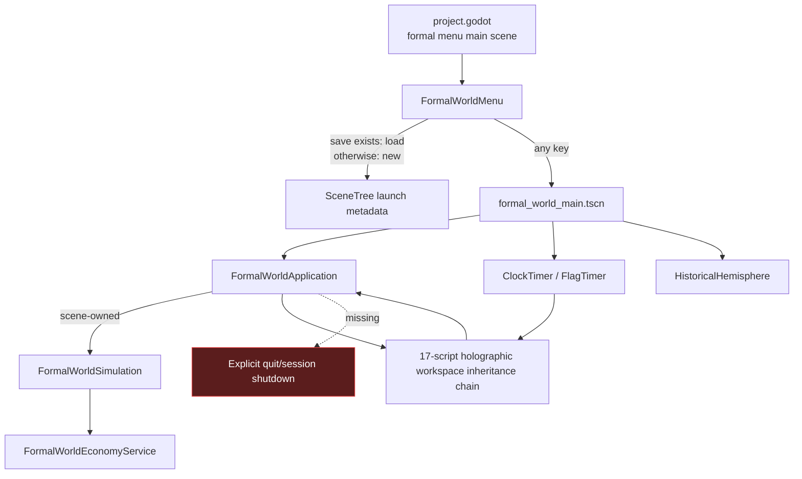
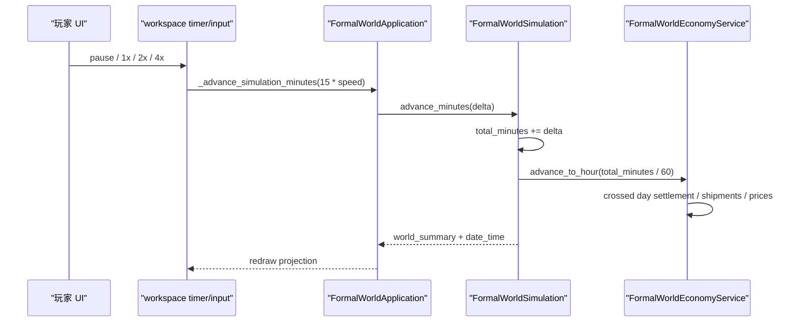
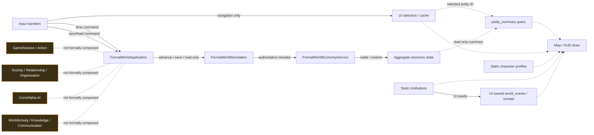
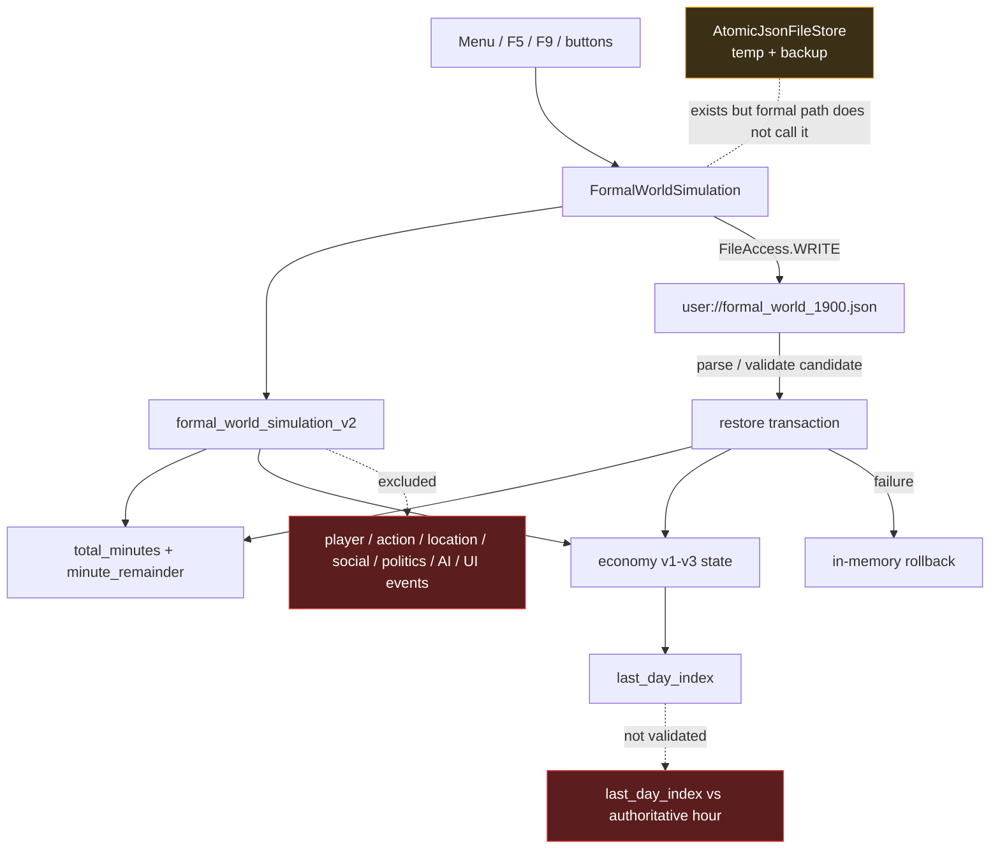
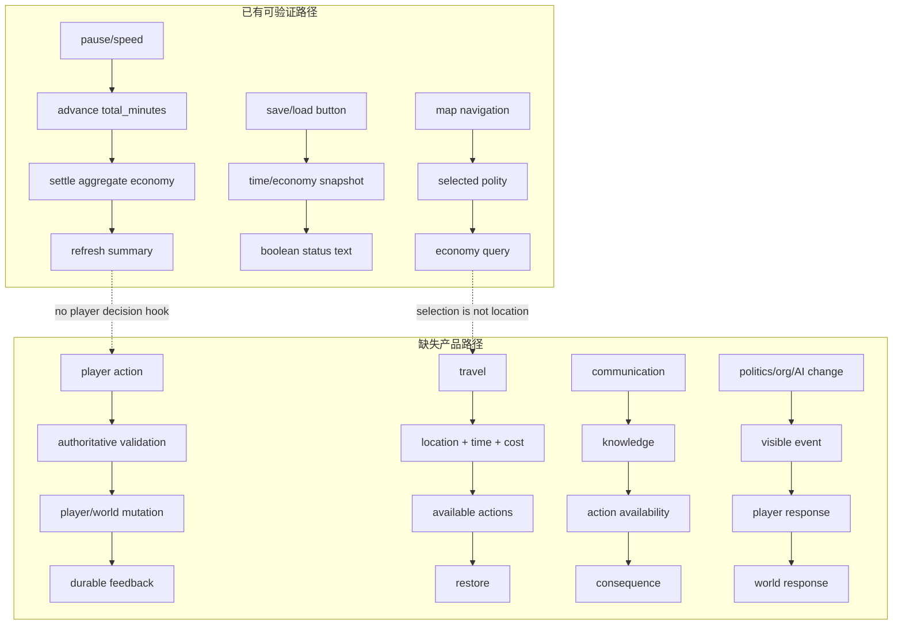
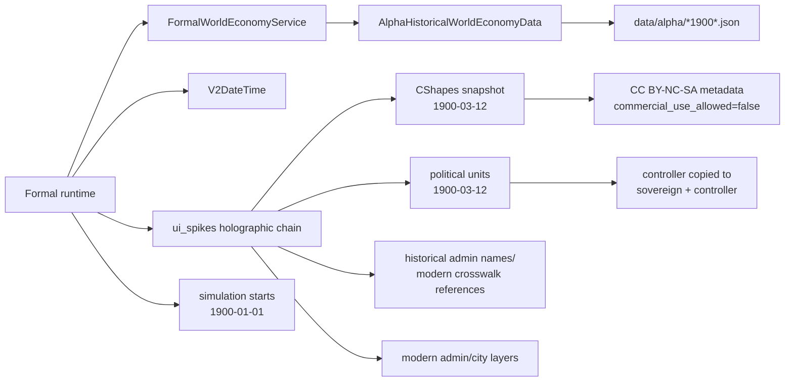
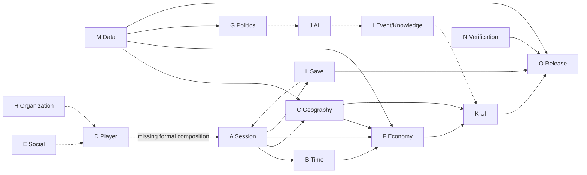

# 正式产品依赖与因果图

## 图例与范围

本图固定于 `0feed6add253cead359a9e41f85e09bdf84c24e7`。实线表示生产运行调用/持有，虚线表示只读投影或数据依赖，点划语义在图中文字中明确。正式边界来自 `project.godot` 的主场景和可达扫描；不存在 autoload。图中的 Alpha、V2 和 ui_spikes 名称表示代码来源，不表示它们必然是 legacy：被正式入口实际到达的节点属于正式运行边界。

## 1. 启动与场景生命周期

解释：菜单会根据唯一正式存档是否存在自动选择 new/load，并把模式写入场景树 metadata；任意键进入主场景。主场景创建应用节点、timer、半球；应用局部创建 `FormalWorldSimulation`，没有 autoload 或全局 session。`FormalWorldApplication` 是深 UI 继承链的子类，timer 回调由基类处理，最终调用应用 override，形成受控的模板方法回路，而不是两个世界时钟。显式退出和 shutdown owner 缺失（E001–E005、E038、E040、E045）。

## 2. 正式时间与模拟调度

解释：正式唯一累计时间是 `FormalWorldSimulation.total_minutes`。UI 只持暂停/倍速，并把 15 分钟乘倍速的命令交给应用；simulation 更新时间后以小时驱动经济。经济在跨过边界时日结，UI 再读取摘要。`V2DateTime` 只是日期派生依赖，不是第二可写时钟。当前没有玩家行动、社会、政治或 AI 订阅这条正式 schedule（E005、E006、E009、E012、E030、E032）。

隐式契约：经济 `total_hour` 由 simulation 注入的 `Callable` 读取；`minute_remainder` 从累计分钟派生。未来服务必须在组合根明确注册边界顺序，不得自行查询 wall clock 或创建 V2/Alpha 平行时钟。

## 3. 状态写入与只读投影

解释：生产源码中应用对正式 simulation 的写调用只有推进、保存和读取。地图/人物/机构浏览写的是 UI selection/cache；政治单元 ID 只用于查询经济投影。静态机构 agenda 被 UI 自行转成 `_world_events` 和未读数，这是展示状态越界，不是模拟事件。仓库内的玩家、行动、社会、组织、关系、世界活动、知识、通信和 AI 服务没有被正式应用组合；虚线隔离关系不能被解释为运行依赖（E019–E026、E032、E039、E044）。

当前因果闭环只有“时间 → 聚合经济变化 → UI 摘要”。缺少“玩家业务命令 → 权威玩家/世界状态 → UI 反馈”，也缺少“非玩家政治/组织/AI 变化 → 玩家获知 → 应对 → 后续反馈”。

## 4. 保存、恢复与失败边界

解释：正式 schema 的内存 restore 有候选验证和失败回滚，时间/经济旧版本兼容有测试。磁盘写却直接覆盖目标文件，未使用已有临时文件与备份能力。快照排除所有未来关键系统，且经济 `last_day_index` 未与权威小时建立恢复不变量。因此“磁盘写成功”和“完整连续会话可恢复”都不能从现测试推出（E007、E010、E012、E018、E023、E046）。

恢复的目标顺序应在下一阶段固定为：读取/校验 envelope → 构建全部候选子状态 → 校验跨系统 ID/时间/上限/双向索引 → 一次提交 → 失败不改现状态。原子 file store 只负责耐久性，不应成为业务 schema owner。

## 5. UI 操作到产品后果

解释：时间—经济—摘要和地图 selection—经济查询是现有真实路径；保存读取只覆盖其子集。玩家行动、旅行、社会知识、政治/组织/AI 反馈四类业务链缺失。图中特意不把静态人物卡、机构 agenda 或 retained service tests 接到缺失链上，因为它们不是正式生产调用（E011、E017、E019、E024、E031、E039、E042、E048）。

## 6. 数据、历史语义与来源泄漏

解释：正式运行跨越 formal、Alpha、V2.2 和 ui_spikes 命名空间。它还同时使用 1900-01-01 模拟起点、1900-03-12 政治快照和现代下级行政参考。来源命名泄漏本身不是运行错误；真正风险是维护 owner、历史时点、政治语义、许可与 ID contract 未显式化。任何目录迁移必须先有行为等价测试；任何发布必须先有许可负责人决策与打包门禁（E027–E030、E040、E041、E043、E052）。

## 7. 系统级依赖 DAG 与必要串行关系

解释：实线是当前正式或发布依赖；A↔L 看似循环，其实是会话编排与存储子服务的生命周期回路：A 决定何时保存/恢复，L 必须完整恢复 A 拥有的状态。它必须通过接口和事务顺序打破代码互相持有。虚线是产品设计上需要但当前未正式组合的依赖，不能被当作现有运行边。

必要串行顺序：

1. 玩家权威（A/D/K）先于个人经济、旅行、社会或 AI 命令。
2. 完整快照与原子耐久性（L）先于新增持久系统。
3. 政治单元/经济体/LocationId 契约（C/F/G/M）先于旅行、战争或地图驱动经济。
4. 权威事件/知识可见性（I）先于媒体或自主政治反馈。
5. 正式/核心组合契约先于复用 GameSession、Society、Organization、Relationship 或 AI。

## 隐式依赖与环风险清单

- UI timer 通过基类回调调用应用 override，是隐式模板方法依赖；改继承链前必须有暂停/倍速行为测试。
- 正式经济通过注入 callable 读取时间，是隐式只读依赖；不得反向推进时间。
- 地图 selection 到经济体依赖 crosswalk 和 fallback ID，是数据层隐式依赖；必须双向校验并随存档版本化。
- UI `_world_events` 依赖 institution agenda，却被画成世界活动，是错误 owner 环的前兆：世界事实不应从 UI 生成再被 UI 当来源读取。
- A 与 L 的会话/保存回路必须由组合根单向编排；子服务不得直接调用 UI 或 SceneTree。
- AI 若直接持 Society/Economy 并自行 tick，会形成第二 scheduler 和跨 owner 写环；应只提交权威命令。
- `active_character_key` 与 `GameSessionService.player_character` 是近似概念，不是已证明重复；先定产品身份语义，再做适配。

## 目标依赖形状

目标不是一次搬迁所有代码，而是形成一个窄的组合根：`FormalWorldSimulation` 拥有正式时间、一个玩家 session、聚合经济和后续逐个接入的子服务；每个子服务公开命令、查询、snapshot/restore 和 invariants；UI 只发命令/读投影；FormalSaveCoordinator 对所有子状态做一次事务；CI 用真实产品路径而非目录/类存在性判定成熟度。
